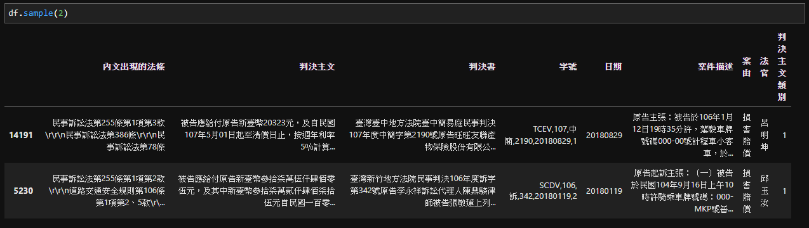

# DecisionPrediction
歡迎來到損害賠償案件判決預測！
此項目的研究動機本是因為工作上的老闆對於判決預測有興趣，後來因種種原因擱置之後，我自己將此項目稍微完善並分享於此。

## 訓練資料來源
[司法院判決書開放資料下載](http://210.69.124.88/)  
時間為 2017年10月 至 2018年9月，共一年的民事案件資料。  
其中選擇數量較多且判決書中有明確判決原因的損害賠償案件作為訓練資料，共 9,062 筆  

## 資料清理
將判決書整理為結構化資料：  

* **案件描述**  
主要為原告和被告的主張、陳述，以及案件描述。不會包含判決結果。  
* **判決主文**  
法官的判決結果  
* **判決結果**   
由判決主文決定判決結果，並分為以下三種  
  1. 原告訴求或部分訴求法官同意(原告勝訴)  
  2. 原告訴求遭法院駁回(原告敗訴)  
  3. 其他(像是原判決廢棄、案件移送其他法院等)  

p.s. 其餘欄位像是出現的法條、法官等雖然我有整理出來，但並沒有實際應用到判決預測中。

## 模型介紹與說明
* **使用套件**：  
Pandas、Jieba、Gensim、Sklearn、Keras  

* **訓練流程與模型介紹**：    
  1. **模型結構**:  
  案件描述輸入 > embedding(word2vec) > LSTM(雙向GRU) > Attention >  
  連接層 > LSTM(雙向GRU) > Attention(產出句子權重) > 連接層 > 判決結果  
  2. **訓練結果**:  
  epochs = 23 、 train_acc = 0.826 、 test_acc = 0.830  
  3. **句子重要性**:  
  --施工中--  

* **模型下載**：  
訓練資料(暫不提供)  
結巴繁中字典_含法律專有名詞(暫不提供)  
word2vec模型(暫不提供)  
預測模型(暫不提供)  

## 參考資料
以下連結與資料在我學習過程中提供了一些很棒的想法和思路  
[2018中国‘法研杯’法律智能挑战赛（CAIL2018）个人作品](https://github.com/renjunxiang/Competition_CAIL)  
[文字探勘on判決預測](http://www.52nlp.cn/tag/textcnn)  
[Attention](https://gist.github.com/cbaziotis/6428df359af27d58078ca5ed9792bd6d)  
[Leemeng-NLP](https://leemeng.tw/tag/zi-ran-yu-yan-chu-li.html)  

## TODO
- [X] 上傳訓練模型code  
- [ ] 完善github

